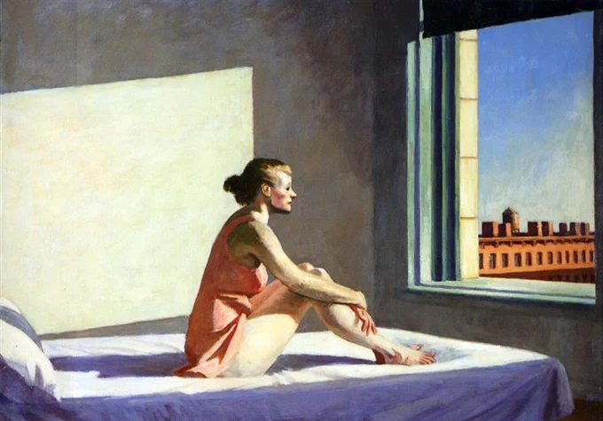

حضرت #مولانا خیلی به رباعیات‌ش مشهور نیست. اما این رباعی را احتمالاَ همه شنیده‌ایم:

هر روز دلم در غم تو زارتر است
وز من، دل بیرحم تو بی‌زارتر است

بگذاشتی‌ام غم تو نگذاشت مرا
حقا که غمت از تو وفادارتر است

تجسم شعر مولوی دنیای آپارتمانی ما می‌شود این نقاشی #ادوارد_هاپر

