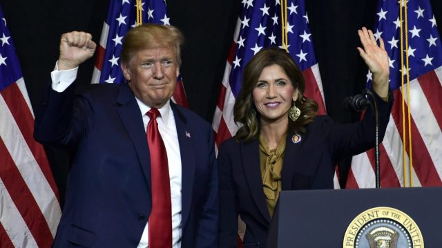

با حمایت کریستی نوئم، فرماندار داکوتای جنوبی از دونالد ترامپ، تعداد فرمانداران حامی رییس جمهوری سابق آمریکا در انتخابات ریاست جمهوری 2024 به چهار تن افزایش یافت؛ به همراه حداقل 10 سناتور و 76 عضو مجلس نمایندگان

https://thehill.com/homenews/campaign/4195342-noem-endorses-trump-for-2024/

