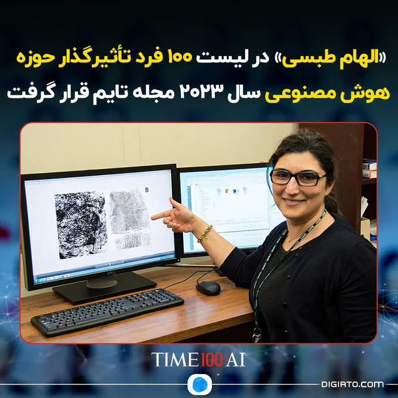

💯 «الهام طبسی» در لیست 100 فرد تأثیرگذار حوزه هوش مصنوعی سال 2023 مجله تایم قرار گرفت

مجله تایم لیست 100 فرد تأثیرگذار در زمین هوش مصنوعی را اعلام کرده است که در آن نام افرادی از جمله «سم آلتمن»، مدیرعامل OpenAI، «دمیس حسابیس»، مدیرعامل DeepMind و ایلان ماسک به چشم می‌خورد.

نکته قابل‌توجه دیگر این لیست حضور «الهام طبسی» پژوهشگر ارشد ایرانی موسسه ملی استاندارد و فناوری (NIST) و معاون بخش فناوری‌های نوظهور آزمایشگاه فناوری اطلاعات (ITL) است.

طبسی که در ایران به‌دنیا آمده و بزرگ شده است، همیشه آرزوی دانشمندن شدن را در سر داشته است. او در سال 1994 برای تحصیلات تکمیلی خود به ایالات متحده مهاجرت کرد و پنج سال بعد در NIST کار خود را روی پروژه‌های مختلف یادگیری ماشین و بینایی کامپیوتر آغاز کرد.

جزئیات بیشتر را در دیجیاتو بخوانید: https://dgto.ir/34lc

