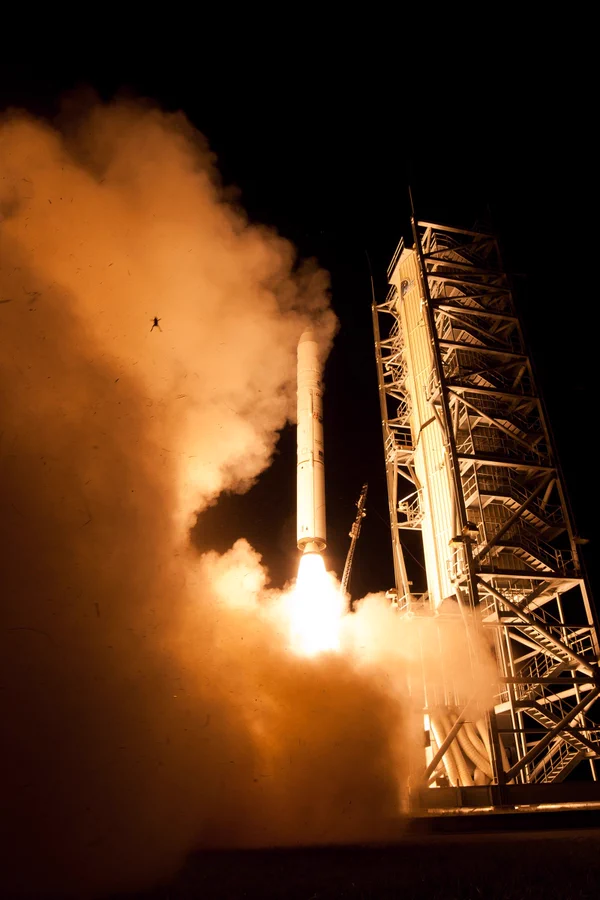

ده سال پیش در چنین روزی موشک ناسا (پروژه ی LADEE، بررسی ماه) پرتاب شد
و این تصویر ‌ بخاطر وجود یک قورباغه در عکس معروف شد 🐸

(وضعیت قورباغه نامشخص موند اما ناسا تمامی سعی خودش رو میکنه تا به هنگام پرتاب، هیچ آسیبی به موجودات زنده نرسه)
#ناسا_فارسی

