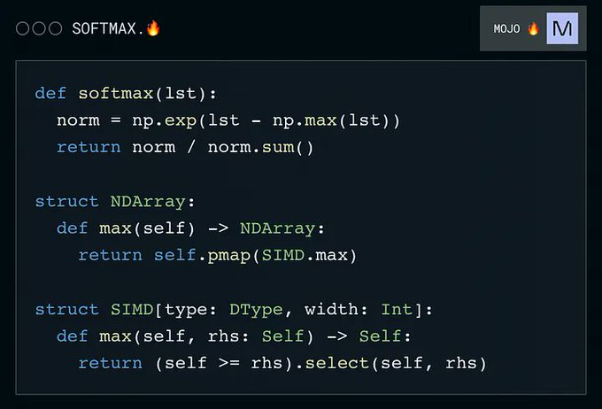

امروز کامیونیتی انگلیسی پر شده از Mojo که در دسترس همه قرار گرفته، زبان برنامه نویسی جدیدی که از سینتکس پایتون درست شده و با کتابخونه های این زبان سازگاره.
۳۵۰۰۰ برابر پایتون سریعتره و این واقعیه!
فعلا زوده واسه مهاجرت جدید، ولی آینده جالبی داره.
نظر شما؟
https://github.com/modularml/mojo

